# Execution Plan

## Detailed Analysis Summary

### Change Impact Assessment
- **User-facing changes**: Yes — 전체 시스템이 새로운 사용자 인터페이스 (고객용 + 관리자용)
- **Structural changes**: Yes — 신규 시스템 아키텍처 설계 필요
- **Data model changes**: Yes — 전체 데이터 모델 신규 설계 (12개 엔티티)
- **API changes**: Yes — 전체 REST API 신규 설계
- **NFR impact**: Yes — 보안, 성능, 실시간 통신, 클라우드 배포

### Risk Assessment
- **Risk Level**: Medium
- **Rollback Complexity**: Easy (신규 프로젝트이므로 롤백 불필요)
- **Testing Complexity**: Complex (실시간 통신, 다중 매장, 복합 옵션)

---

## Workflow Visualization

```mermaid
flowchart TD
    Start(["User Request"])
    
    subgraph INCEPTION["🔵 INCEPTION PHASE"]
        WD["Workspace Detection<br/><b>COMPLETED</b>"]
        RA["Requirements Analysis<br/><b>COMPLETED</b>"]
        US["User Stories<br/><b>COMPLETED</b>"]
        WP["Workflow Planning<br/><b>COMPLETED</b>"]
        AD["Application Design<br/><b>EXECUTE</b>"]
        UG["Units Generation<br/><b>EXECUTE</b>"]
    end
    
    subgraph CONSTRUCTION["🟢 CONSTRUCTION PHASE"]
        FD["Functional Design<br/><b>EXECUTE</b>"]
        NFRA["NFR Requirements<br/><b>EXECUTE</b>"]
        NFRD["NFR Design<br/><b>EXECUTE</b>"]
        ID["Infrastructure Design<br/><b>EXECUTE</b>"]
        CG["Code Generation<br/><b>EXECUTE</b>"]
        BT["Build and Test<br/><b>EXECUTE</b>"]
    end
    
    Start --> WD
    WD --> RA
    RA --> US
    US --> WP
    WP --> AD
    AD --> UG
    UG --> FD
    FD --> NFRA
    NFRA --> NFRD
    NFRD --> ID
    ID --> CG
    CG --> BT
    BT --> End(["Complete"])
    
    style WD fill:#4CAF50,stroke:#1B5E20,stroke-width:3px,color:#fff
    style RA fill:#4CAF50,stroke:#1B5E20,stroke-width:3px,color:#fff
    style US fill:#4CAF50,stroke:#1B5E20,stroke-width:3px,color:#fff
    style WP fill:#4CAF50,stroke:#1B5E20,stroke-width:3px,color:#fff
    style AD fill:#FFA726,stroke:#E65100,stroke-width:3px,stroke-dasharray: 5 5,color:#000
    style UG fill:#FFA726,stroke:#E65100,stroke-width:3px,stroke-dasharray: 5 5,color:#000
    style FD fill:#FFA726,stroke:#E65100,stroke-width:3px,stroke-dasharray: 5 5,color:#000
    style NFRA fill:#FFA726,stroke:#E65100,stroke-width:3px,stroke-dasharray: 5 5,color:#000
    style NFRD fill:#FFA726,stroke:#E65100,stroke-width:3px,stroke-dasharray: 5 5,color:#000
    style ID fill:#FFA726,stroke:#E65100,stroke-width:3px,stroke-dasharray: 5 5,color:#000
    style CG fill:#4CAF50,stroke:#1B5E20,stroke-width:3px,color:#fff
    style BT fill:#4CAF50,stroke:#1B5E20,stroke-width:3px,color:#fff
    style Start fill:#CE93D8,stroke:#6A1B9A,stroke-width:3px,color:#000
    style End fill:#CE93D8,stroke:#6A1B9A,stroke-width:3px,color:#000
    style INCEPTION fill:#BBDEFB,stroke:#1565C0,stroke-width:3px,color:#000
    style CONSTRUCTION fill:#C8E6C9,stroke:#2E7D32,stroke-width:3px,color:#000
    
    linkStyle default stroke:#333,stroke-width:2px
```



### Text Alternative
```
Phase 1: INCEPTION
- Workspace Detection (COMPLETED)
- Requirements Analysis (COMPLETED)
- User Stories (COMPLETED)
- Workflow Planning (COMPLETED)
- Application Design (EXECUTE)
- Units Generation (EXECUTE)

Phase 2: CONSTRUCTION (per-unit)
- Functional Design (EXECUTE)
- NFR Requirements (EXECUTE)
- NFR Design (EXECUTE)
- Infrastructure Design (EXECUTE)
- Code Generation (EXECUTE)
- Build and Test (EXECUTE)
```

---

## Phases to Execute

### 🔵 INCEPTION PHASE
- [x] Workspace Detection (COMPLETED)
- [x] Requirements Analysis (COMPLETED)
- [x] User Stories (COMPLETED)
- [x] Workflow Planning (COMPLETED)
- [ ] Application Design - **EXECUTE**
  - **Rationale**: 신규 시스템으로 컴포넌트 식별, 서비스 레이어 설계, 컴포넌트 간 의존성 정의 필요
- [ ] Units Generation - **EXECUTE**
  - **Rationale**: 복잡한 시스템(백엔드 API, 프론트엔드 2개, 인프라)으로 병렬 개발을 위한 작업 단위 분해 필요

### 🟢 CONSTRUCTION PHASE (per-unit)
- [ ] Functional Design - **EXECUTE**
  - **Rationale**: 복합 옵션 시스템, 세션 관리, 주문 상태 머신 등 복잡한 비즈니스 로직 상세 설계 필요
- [ ] NFR Requirements - **EXECUTE**
  - **Rationale**: 보안(Security Baseline 15개 규칙), 성능(SSE 2초), 확장성 요구사항 구체화 필요
- [ ] NFR Design - **EXECUTE**
  - **Rationale**: NFR 패턴을 실제 설계에 반영 (JWT 인증 흐름, SSE 구현, 보안 헤더 등)
- [ ] Infrastructure Design - **EXECUTE**
  - **Rationale**: AWS 클라우드 배포 (EC2, RDS, S3, VPC 등) 인프라 설계 필요
- [ ] Code Generation - **EXECUTE** (ALWAYS)
  - **Rationale**: 구현 계획 수립 및 코드 생성
- [ ] Build and Test - **EXECUTE** (ALWAYS)
  - **Rationale**: 빌드, 테스트 (PBT 포함), 검증

### 🟡 OPERATIONS PHASE
- [ ] Operations - PLACEHOLDER
  - **Rationale**: 향후 배포 및 모니터링 워크플로우

---

## Success Criteria
- **Primary Goal**: 다중 매장 지원 테이블오더 MVP 시스템 구축
- **Key Deliverables**:
  - FastAPI 백엔드 (인증, 메뉴, 주문, 테이블 관리 API)
  - React 고객용 프론트엔드 (메뉴 조회, 장바구니, 주문)
  - React 관리자용 프론트엔드 (주문 모니터링, 테이블/메뉴 관리)
  - AWS 인프라 설계 (EC2, RDS MySQL, S3)
  - 보안 규칙 준수 (Security Baseline)
  - Property-Based Testing 포함 테스트 스위트
- **Quality Gates**:
  - 모든 API 엔드포인트 입력 검증
  - JWT 인증 및 권한 검사
  - SSE 실시간 주문 전달 (2초 이내)
  - INVEST 기준 충족하는 사용자 스토리 커버리지
